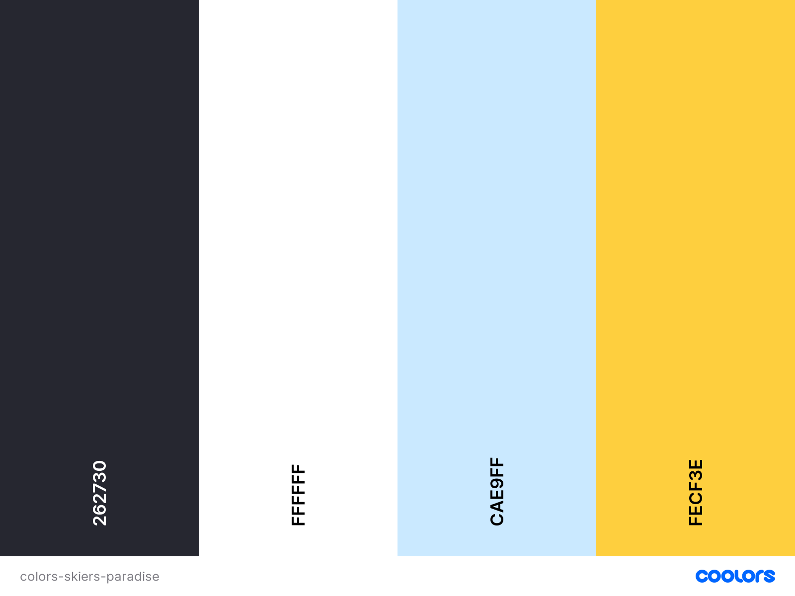

# Skiers Paradise

*(Above logo is under construction.)*

Ski lovers **share information** about the **best downhill Ski places in the world**, to inspire each other but also everyone else who want **to find their own Skiers Paradise**.
 
## UX
<!--
Use this section to provide insight into your UX process, focusing on who this website is for, what it is that they want to achieve and how your project is the best way to help them achieve these things.

In particular, as part of this section we recommend that you provide a list of User Stories, with the following general structure:
- As a user type, I want to perform an action, so that I can achieve a goal.

This section is also where you would share links to any wireframes, mockups, diagrams etc. that you created as part of the design process. These files should themselves either be included as a pdf file in the project itself (in an separate directory), or just hosted elsewhere online and can be in any format that is viewable inside the browser.
-->
### External users goal
A place to find (and in the future also share) **information and up-to-date facts** about the **best downhill ski places in the world**. 
And also being able to **join Skiing-journeys with other ski lovers**.

### Site owners goal
To **share information** with other ski lovers in the club and also **find new skiing friends** on the travels they arrange.
In the long run **advertisers** will get the opportunity to put adds in the site. In this way the club can **earn money** and get **partners** 
and **sponsors**. 

### Potential features, grouping of the features and in order of prioritize
- **Header**, fixed at the top of viewport, with:
    - **logo**
    - **navbar**
- **Information**-section with:
    - **Map** with with labels on skiing resorts.
    - **Skiing-resort information** matching the label user has **choosen in map**.
- **Trip**-section with:
    - **Information** about the yearly skitrip
    - **Sign up -form** for the skiing-trip
- **Recommendation**-section with:
    - **Table with 10-top** skiing resort sorted with the best in the top. Providing possibility to do users own ranking of place and
interactive update of the list.
    - **Reviews** of ski resorts
- **About** -section with:
    - Information on **the Skiers Paradise club**
- **Footer**-section with:
    - The clubs **contact and social media** information


### User stories 
- As a user I want to know where good skiing places are situated on a **map**.
- As a user I want to find up-to-date **information and facts** about downhill skiing places, to be able to choose where I am going
on my next ski trip and/or get up-date-information, as wheather, at the place I am going to.
- Aa a user I want to find **information** about the clubs **yearly skiing-trip**.
- As a user I want to **sign up** for the club's yearly **skiing-trip**, so I can join the trip and go skiing with other ski lovers.
- As a user I want to see **which skiing places are most popular** according to the club and the sites visitors, so I am inspired when 
I think of my next trip.
- As a user I want to be able to **grade the different skiing places**, and interactively how my vote affects the 10-top-list. So I can
contribute to other ski lovers travel choises.
- As a user I want to see **reviews** of different places, so I get inspired for my next skiing-trip.
- As a user I want **information about the club**, so I know that the information I receive is serious.

## User requirements and Expectations

### Requirements
- Navigate the website using **navbar**
- Based on a **map** find **information** about different ski resort.
- Get **information** about this years **skiing-trip** with the club.
- **Sign up for the skiing-trip** and give information as full name, email-adress, telephone-number, skiing-level and voluntary text.
- An updated list of the 10 most popular ski-resorts with name of the place and ranking.
- Possibility to give the ski-resorts **own grade** and the 10-top-list is updated accordingly.
- See **reviews** on ski resorts, from other skiiers.
- Short information **about the club**

### Expectations
- Content is **visually satisfying and informative**
- **Easily understandable navigation** take user to correct place
- **Links and buttons** work as espected
- **Responsive design** fitting on mobile, tablet and desktop
- **Form validation** works correctly
- **New rating is correctly calculated** after user graded a ski resort.
- **Updating of 10-top-list** works after user grading.

## Wireframes
I used [Balsamiq Wireframes](https://balsamiq.com/) to build rudimentary wireframes for a basic understanding.
I have made frames for desktop, tablet and mobile:
- [Wireframe for Desktop](https://github.com/Carina-P/Skiers-Paradise/blob/master/assets/wireframes/wireframe-desktop.pdf)
- [Wireframe for Tablet](https://github.com/Carina-P/Skiers-Paradise/blob/master/assets/wireframes/wireframe-tablet.pdf)
- [Wireframe for Mobile](https://github.com/Carina-P/Skiers-Paradise/blob/master/assets/wireframes/wireframe-mobile.pdf)

### Major changes compared to above wireframes

## Design Choices
### Fonts
I have choosen **Varela**, because i find it **modern** and stylish but also **clean** and easy to read. "Because it is extremely clean and minimalistic in design, it is able to sit well in body text at small sizes, 
or be used for headlines and menu items." (quote from https://fonts.google.com/specimen/Varela#standard-styles). And as the alternative: Montserrat.
### Icons

### Colors
I want the colors to match a day in the skiing slope: White for **snow**, light-blue for the **sky** and yellow for the **sun**. 


- **Text** to contrast lighter backgrounds: **Raisin black** #262730
- **Main background** and if background is dark: **White** #ffffff
- **Framing** as borders: **Columbia blue** #cae9ff
- Details to **stick out** as buttons: **Sunglow** #fecf3e

## Features
- **Header**, fixed at the top of viewport, with:
    - **logo**
    - **navbar**
- **Map** with with labels at skiing resorts.
- **Skiing-resort information** matching the label user has **choosen in map**.
- **Skiing-trip** information
- **Sign up -form** for the skiing-trip
- **Table with 10-top** skiing resort sorted with the best in the top. Providing possibility to do users own ranking of place and
interactive update of the list.
- **Reviews** of ski resorts
- **About** the Skiers Paradise club
- **Footer** with contacts and social media

<!--
In this section, you should go over the different parts of your project, and describe each in a sentence or so.
 
### Existing Features
- Feature 1 - allows users X to achieve Y, by having them fill out Z
- ...

For some/all of your features, you may choose to reference the specific project files that implement them, although this is entirely optional.

In addition, you may also use this section to discuss plans for additional features to be implemented in the future:

### Features Left to Implement
- Another feature idea
-->
## Technologies Used

In this section, you should mention all of the languages, frameworks, libraries, and any other tools that you have used to construct this project. For each, provide its name, a link to its official site and a short sentence of why it was used.


### Languages
- [HTML](https://developer.mozilla.org/en-US/docs/Web/HTML) 
    - The perfect language to build a static site.
- [CSS](https://developer.mozilla.org/en-US/docs/Web/CSS) 
    - For styling the site
- [JavaScript](https://www.javascript.com/)
    - Bringing interactivity to the site.
### Tools and libraries
- [Git](https://git-scm.com/)
    - For version control and storing the code
- [Bootstrap](https://getbootstrap.com/)
    - A helpful HTML, CSS (and JS) library that is great for responsive design.
- [JQuery](https://jquery.com/)
    - The project uses **JQuery** to simplify DOM manipulation.
- [JSON](https://www.json.org/json-en.html)
    - A data-interchange format used when retrieve information from other sources as...
- [Jasmine](https://jasmine.github.io/)
    - Supports behavior-driven development, makes it easy to build unit test.
<!--* [Popper](https://popper.js.org/)
    * A library to manage poppers in web-applications
-->
<!--
- [Font-Awesome](https://fontawesome.com/icons?d=gallery)
    * From this library I picked the icons
-->
- [Google fonts](https://fonts.google.com/)
    - For inspiration and fonts
- [Balsamiq Wireframes](https://balsamiq.com/)
    - For designing the wireframes
- [Coolors](https://balsamiq.com/)
    - To generate color-schemes
## Testing
When it has been feasible the test where automated. The rest was tested manually. 
The manually testing was performed **regularly** in a **iterative** manner during the development of the site and then **thorough** after all features 
was in place. Testing often  and after a small part of development, makes it is **easier to find** and **fix bugs early** and it is also a way to **use experience** 
in coming development.

When all features was implemented the following tests was performed:
- Validated by [W3S Markup validation service](https://validator.w3.org/)
- Validated by [W3s CSS validation service](https://jigsaw.w3.org/css-validator/)
- According to the **scenarios** as described below
- The **deployed version** was tested
<!--In this section, you need to convince the assessor that you have conducted enough testing to legitimately believe that the site works well. Essentially, in this part you will want to go over all of your user stories from the UX section and ensure that they all work as intended, with the project providing an easy and straightforward way for the users to achieve their goals.

Whenever it is feasible, prefer to automate your tests, and if you've done so, provide a brief explanation of your approach, link to the test file(s) and explain how to run them.

For any scenarios that have not been automated, test the user stories manually and provide as much detail as is relevant. A particularly useful form for describing your testing process is via scenarios, such as:

1. Contact form:
    1. Go to the "Contact Us" page
    2. Try to submit the empty form and verify that an error message about the required fields appears
    3. Try to submit the form with an invalid email address and verify that a relevant error message appears
    4. Try to submit the form with all inputs valid and verify that a success message appears.

In addition, you should mention in this section how your project looks and works on different browsers and screen sizes.

You should also mention in this section any interesting bugs or problems you discovered during your testing, even if you haven't addressed them yet.

If this section grows too long, you may want to split it off into a separate file and link to it from here.
-->
### Scenarios
### Validation with W3S
### Some of the bugs

## Deployment
Skiers Paradise was developed on GitPod, using git and GitHub to host the repository.

When deploying Skiers Paradise using GitHub Pages the following steps were made:

* Opened up **GitHub** in the browser.
* Signed in using username and password.
* Selected my **repositories**.
* Navigated to **'/Carina-P/Skiers-Paradise'**.
* In the top navigation clicked **'settings'**.
* Scrolled down to the **GitHub Pages** area. 
* Selected **'Master Branch'** from the **'Source'** dropdown menu.
* Clicked to confirm my selection.
* Skiers Paradise now live on GitHub Pages:
 [Skiers Paradise](https://carina-p.github.io/Skiers-Paradise/)

### Running Skiers Paradise locally

Cloning Love Pilates from GitHub:

* Navigate to **'/Carina-P/Skiers Paradise'**.
* Click the green **'Clone or Download'** button.
* Copy the **url** in the dropdown box.
* Using your favourite **IDE** open up your preferred **terminal**.
* Navigate to your desired file location. 
* Copy the following **code** and input it into your terminal to clone Skiers Paradise.
 ```git
  git clone https://github.com/Carina-P/skiers-paradise.git
   ```

<!--
This section should describe the process you went through to deploy the project to a hosting platform (e.g. GitHub Pages or Heroku).

In particular, you should provide all details of the differences between the deployed version and the development version, if any, including:
- Different values for environment variables (Heroku Config Vars)?
- Different configuration files?
- Separate git branch?

In addition, if it is not obvious, you should also describe how to run your code locally.
-->

## Credits

### Content
<!--
- The text for section Y was copied from the [Wikipedia article Z](https://en.wikipedia.org/wiki/Z)
-->
### Media
<!--
- The photos used in this site were obtained from ...
-->
### Acknowledgements

<!--
- I received inspiration for this project from X
-->